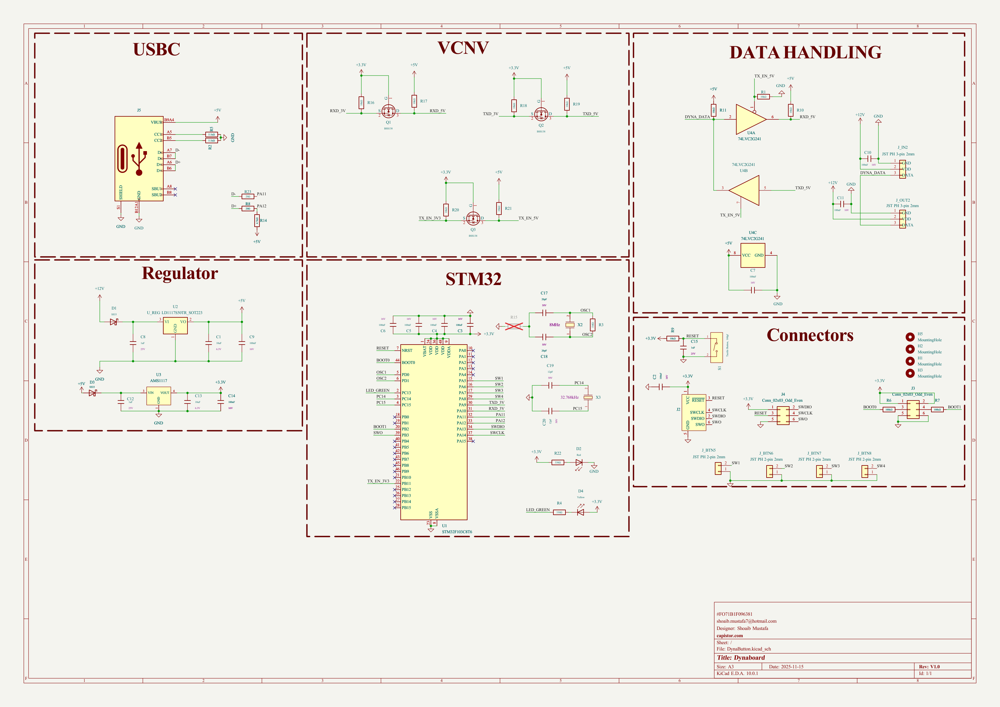
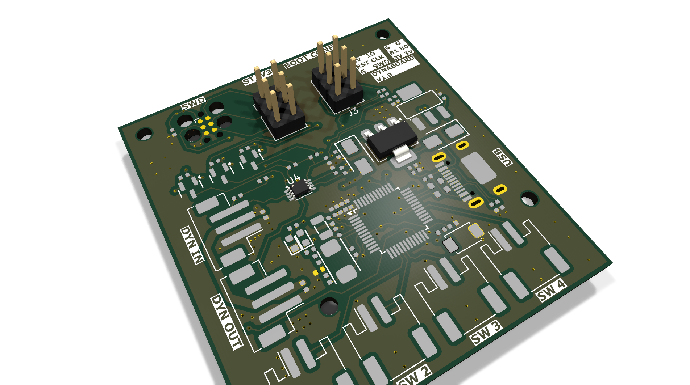
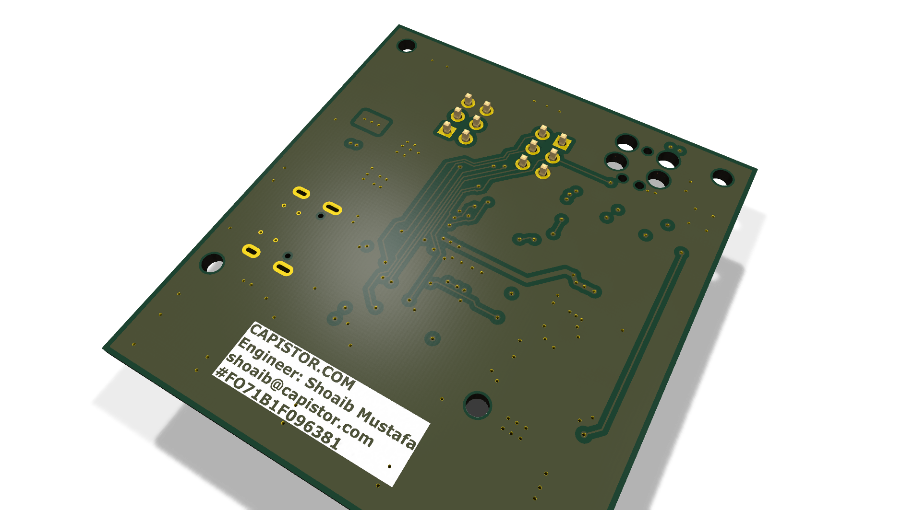
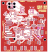
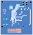

# DynaButton

Dynaboard - STM32F103 multi-button HID/control interface with USB-C and high-density I/O

## At a Glance

- **Status**: Routed
- **Board size**: 48.31 x 52.88 mm
- **Layers**: 4
- **Components**: 68
- **Key ICs**:
  - U1: STM32F103C8T6
  - U2: U_REG LD1117S50TR_SOT223
  - U3: AMS1117
  - U4: 74LVC2G241

## Schematic

Full PDF: [reports/schematic.pdf](reports/schematic.pdf)

## Component Roles

- **STM32F103C8T6** (U1) - main MCU (ARM Cortex-M3, 72 MHz); handles button matrix scanning and USB HID
- **74LVC2G241** (U4) - dual buffer/line driver for clean digital I/O signaling on the button outputs
- **LD1117S50TR** (U2) - 5 V LDO for peripheral rail
- **AMS1117** (U3) - 3.3 V LDO for the STM32 core
- **BSS138** x3 (Q1-Q3) - small-signal N-MOSFETs for level shifting / open-drain signaling between 3.3 V MCU and 5 V peripherals
- **X50328MSB2GI** - 8 MHz crystal for STM32 system clock
- **USB-Type-C 16-pin** connector for power + data
- **SS33 Schottky** x2 (D1, D3) - reverse-polarity protection / freewheel diodes
- **JST-PH 2 mm** connectors for daisy-chained external buttons (J_BTN5-J_BTN8) and pass-through I/O (J_IN2, J_OUT2)

## PCB

**Top copper**

**Bottom copper**

## Bill of Materials

| Refs | Value | Footprint | Qty | MPN | LCSC |
|------|-------|-----------|----:|-----|------|
| C1,C13 | 10uF | PCM_JLCPCB:C_0402 | 2 |  | [C15525](https://www.lcsc.com/product-detail/_C15525.html) |
| C2-C7,C9-C11,C14 | 100nF | PCM_JLCPCB:C_0402 | 10 |  | [C1525](https://www.lcsc.com/product-detail/_C1525.html) |
| C8,C12,C15 | 1uF | PCM_JLCPCB:C_0402 | 3 |  | [C52923](https://www.lcsc.com/product-detail/_C52923.html) |
| C17,C18 | 20pF | PCM_JLCPCB:C_0402 | 2 |  | [C1554](https://www.lcsc.com/product-detail/_C1554.html) |
| C19,C20 | 12pF | PCM_JLCPCB:C_0402 | 2 |  | [C1547](https://www.lcsc.com/product-detail/_C1547.html) |
| D1,D3 | SS33 | PCM_JLCPCB:D_SMA | 2 |  | [C28646294](https://www.lcsc.com/product-detail/_C28646294.html) |
| D2 | Red | PCM_JLCPCB:D_0603 | 1 |  | [C2286](https://www.lcsc.com/product-detail/_C2286.html) |
| D4 | Yellow | PCM_JLCPCB:D_0603 | 1 |  | [C89811](https://www.lcsc.com/product-detail/_C89811.html) |
| J3,J4 | Conn_02x03_Odd_Even | Connector_PinHeader_2.54mm:PinHeader_2x03_P2.54mm_Vertical | 2 |  |  |
| J5 | Connector, USB-TYPE-C-16P | PCM_JLCPCB:TYPE-C-SMD_HX-TYPE-C-16PIN | 1 |  | [C2927039](https://www.lcsc.com/product-detail/_C2927039.html) |
| J_BTN5-J_BTN8 | JST PH 2-pin 2mm | Connector_JST:JST_PH_S2B-PH-SM4-TB_1x02-1MP_P2.00mm_Horizontal | 4 |  |  |
| J_IN2,J_OUT2 | JST PH 3-pin 2mm | Connector_JST:JST_PH_B3B-PH-SM4-TB_1x03-1MP_P2.00mm_Vertical | 2 |  |  |
| Q1-Q3 | BSS138 | PCM_JLCPCB:Q_SOT-23 | 3 |  | [C7420339](https://www.lcsc.com/product-detail/_C7420339.html) |
| R1,R9-R11,R16-R21 | 10kΩ | PCM_JLCPCB:R_0402 | 10 |  | [C25744](https://www.lcsc.com/product-detail/_C25744.html) |
| R2,R5 | 5.1kΩ | PCM_JLCPCB:R_0402 | 2 |  | [C25905](https://www.lcsc.com/product-detail/_C25905.html) |
| R3 | 1MΩ | PCM_JLCPCB:R_0402 | 1 |  | [C26083](https://www.lcsc.com/product-detail/_C26083.html) |
| R4,R22 | 330Ω | PCM_JLCPCB:R_0402 | 2 |  | [C25104](https://www.lcsc.com/product-detail/_C25104.html) |
| R6,R7 | 100kΩ | PCM_JLCPCB:R_0402 | 2 |  | [C25741](https://www.lcsc.com/product-detail/_C25741.html) |
| R8,R23 | 20Ω | PCM_JLCPCB:R_0603 | 2 |  | [C22950](https://www.lcsc.com/product-detail/_C22950.html) |
| R14 | 4.7kΩ | PCM_JLCPCB:R_0402 | 1 |  | [C25900](https://www.lcsc.com/product-detail/_C25900.html) |
| S1 | Tactile Button, 160gf | PCM_JLCPCB:SW_TS-1088-AR02016 | 1 |  | [C720477](https://www.lcsc.com/product-detail/_C720477.html) |
| U1 | STM32F103C8T6 | PCM_JLCPCB:LQFP-48_7x7mm_P0.5mm | 1 |  | [C8734](https://www.lcsc.com/product-detail/_C8734.html) |
| U2 | U_REG LD1117S50TR_SOT223 | Package_TO_SOT_SMD:SOT-223-3_TabPin2 | 1 |  |  |
| U3 | AMS1117 | PCM_JLCPCB:SOT-223-3_L6.5-W3.4-P2.30-LS7.0-BR | 1 |  | [C6186](https://www.lcsc.com/product-detail/_C6186.html) |
| U4 | 74LVC2G241 | Package_SO:VSSOP-8_3x3mm_P0.65mm | 1 |  |  |
| X2 | X50328MSB2GI | PCM_JLCPCB:CRYSTAL-SMD_L5.0-W3.2 | 1 |  | [C115962](https://www.lcsc.com/product-detail/_C115962.html) |
| X3 | Q13FC1350000400 | PCM_JLCPCB:FC-135R_L3.2-W1.5 | 1 |  | [C32346](https://www.lcsc.com/product-detail/_C32346.html) |

_5 of 27 line items don't have an LCSC code in the schematic - search [LCSC](https://www.lcsc.com/) or [JLC parts search](https://jlcsearch.tscircuit.com/) by MPN or footprint when sourcing._

## Files

- `DynaButton.kicad_pro` - KiCad project
- `DynaButton.kicad_sch` - schematic source
- `DynaButton.kicad_pcb` - PCB layout source
- `reports/schematic.pdf` - full schematic (printable)
- `reports/bom.csv` - bill of materials
- `reports/pcb-top.svg`, `reports/pcb-bottom.svg` - copper artwork
- `reports/board-stats.json` - KiCad-generated board statistics

---

_Renders and metadata auto-generated by `Backup-KiCadProject.ps1` using KiCad 10.0._

